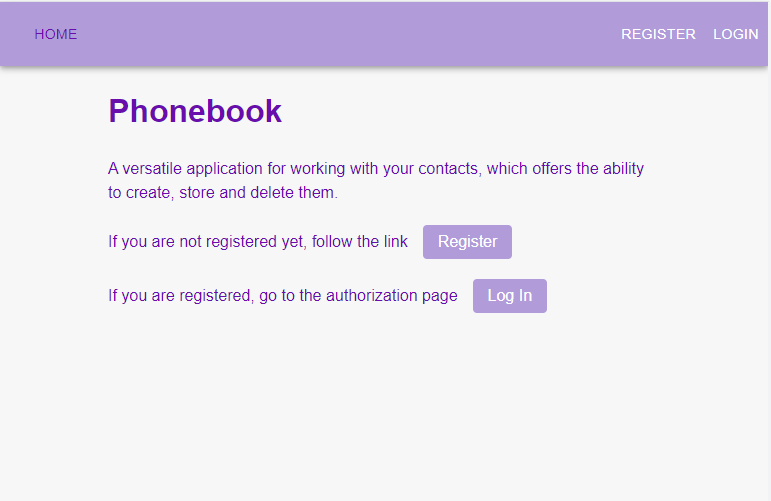
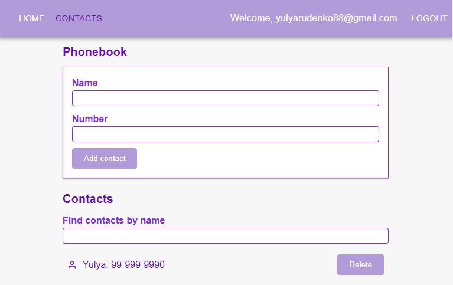

# 📖 Phonebook

A versatile application for working with your contacts, which offers the ability to create, store and delete them.
[Live page](https://yulyarudenko88.github.io/goit-react-hw-08-phonebook/).

### Features:
- Ability to register, login and update the user.
- Working with a private collection of contacts (adding, deleting, searching for contacts).

### Technology stack:
- **HTML** 
- **React**
- **React-router-dom**
- **React-toastify**
- **Redux-toolkit** 
- **Axios**
- **Emotion**
- **Material-ui**

Github repository: [https://github.com/yulyarudenko88/goit-react-hw-08-phonebook](https://github.com/yulyarudenko88/goit-react-hw-08-phonebook)